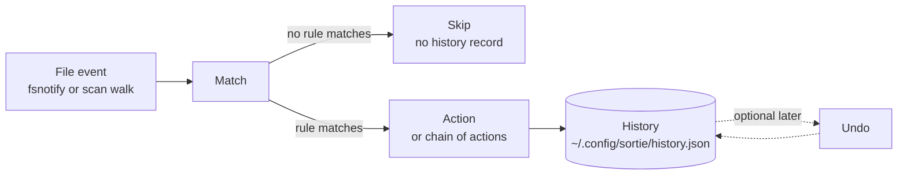
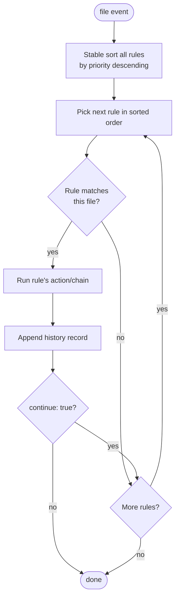
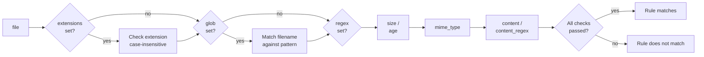
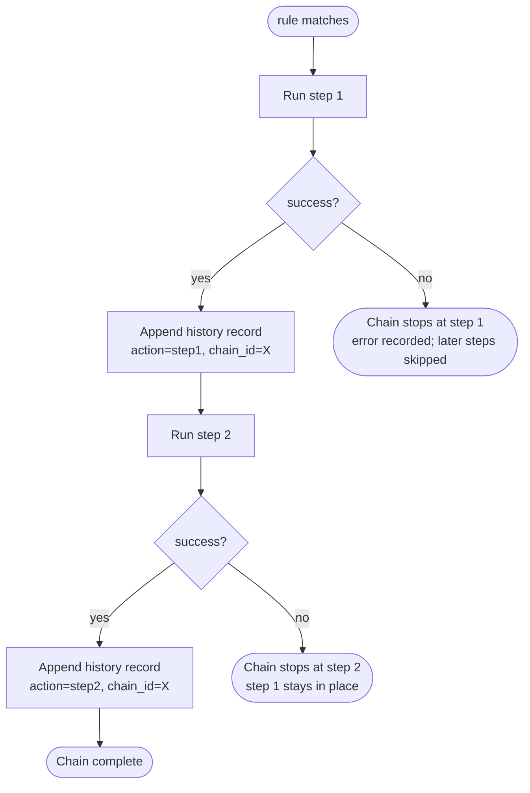

# Concepts

The mental model behind sortie. Read this once and the [Cookbook](03-cookbook.md) will feel like applied common sense.

This page is concept-first, not reference-first. Each section explains what's happening and **why**, walks through a concrete example, then points at the Reference page for exhaustive detail.

- [The pipeline](#the-pipeline) — what happens when a file arrives
- [Rules and priority](#rules-and-priority) — how sortie decides which rule fires
- [Matching](#matching) — what it means for a file to match
- [Capture groups](#named-captures-from-content_regex) — extracting structured data from files
- [Actions and chains](#actions-and-chains) — single steps and multi-step pipelines
- [Reversibility](#reversibility) — what undo can and cannot recover
- [Safety net: dry-run, history, undo](#safety-net-dry-run-history-undo) — operating sortie with confidence
- [Watch vs scan](#watch-vs-scan) — daemon mode versus one-shot
- [Templates](#templates) — variables and template-language features
- [Thinking in sortie](#thinking-in-sortie) — how to design a rule set

---

## The pipeline

Every file sortie touches goes through the same five-stage pipeline:



The five stages, in order:

1. **Event.** Either a `fsnotify` event from `sortie watch`, or a synchronous filesystem walk from `sortie scan`. From sortie's perspective they look identical — a path and a `FileInfo` struct.
2. **Match.** Every rule is tested. The walking order and stopping behavior is covered in the [next section](#rules-and-priority).
3. **Action.** The matched rule's action — or full chain of actions — runs. Side effects to disk happen here.
4. **History.** A JSON record per action is appended to `history.json`. Crucially, this only happens for **real runs**; `--dry-run` evaluates everything up through the action choice but skips the actual action and the history write.
5. **Undo (optional, later).** `sortie undo` reads a history record, looks at its `action` field, and runs the inverse where one exists.

That's the whole system. The depth in the rest of this page is just zooming in on each stage.

### A worked example to anchor everything

Walk this concrete trace mentally; the rest of the page will refer back to it.

You drop `Acme-Invoice-2026-04-25.pdf` into `~/Downloads`. Your config has these rules (abbreviated):

```yaml
rules:
  - name: tag-invoices
    priority: 100
    continue: true                 # don't stop here
    match:
      extensions: [.pdf]
      content: invoice
    action:
      type: tag
      tags: [Red, Finance]

  - name: file-pdfs
    match:                         # priority defaults to 0
      extensions: [.pdf]
    action:
      type: move
      dest: ~/Documents/PDFs/{{.Year}}/{{.Name}}{{.Ext}}
```

Pipeline trace:

1. **Event** — fsnotify reports a `Create` event for `~/Downloads/Acme-Invoice-2026-04-25.pdf`. The watcher debounces 500 ms (in case the browser is still writing), then dispatches.
2. **Match** — sortie sorts rules by priority descending: `tag-invoices (100)` first, `file-pdfs (0)` second. It tests `tag-invoices`: extension matches, content "invoice" matches → **rule fires**. Because `continue: true` is set, evaluation continues. `file-pdfs` is tested next: extension matches → **rule fires**.
3. **Action** — both matched rules' actions run, in priority order. `tag` writes Finder tag metadata to the PDF. `move` then relocates the (now-tagged) PDF to `~/Documents/PDFs/2026/Acme-Invoice-2026-04-25.pdf`.
4. **History** — two records are appended: one for `tag` (rule `tag-invoices`, src is the original path), and one for `move` (rule `file-pdfs`, dest is the new path).
5. *(Later)* — if you regret it, `sortie undo --last 2` reverses both. The `move` reverses (file goes back to Downloads), then `tag` reverses (well, no — `tag` is non-reversible, so `undo` reports it can't reverse and moves on).

That trace touches every stage. The rest of this page explains the **why** behind each step.

---

## Rules and priority

A rule has a name, a `match:` block, an action (or `actions:` list), and optional modifiers (`priority`, `continue`, `cooldown`). Rules live in two places:

- **Global rules** — the `rules:` list in `~/.config/sortie/config.yaml`.
- **Per-directory rules** — a `.sortie.yaml` file inside any watched directory. These are merged with globals whenever sortie processes a file under that directory.

The merge is **flat** — local and global rules go into the same evaluation list. Priority decides what fires, not where the rule lives.

### Priority and `continue` interaction

Every rule has an integer `priority:` (default `0`). Higher numbers run first. `continue: true` causes evaluation to fall through to the next matching rule instead of stopping at the first match.

Here's the full evaluation algorithm:



A few subtleties worth noting:

- **The sort is stable.** When two rules tie on priority, the one that appears first in YAML wins. So you can rely on top-to-bottom ordering as a tiebreaker without setting priorities everywhere.
- **`continue` runs the action even on the rules that fall through.** It's not a "test only" flag — the matched action runs every time. If you set `continue: true` on three rules that all match the same file, all three actions run, in priority order.
- **Per-directory and global rules sort together.** A `priority: 10` global rule beats a `priority: 0` per-directory rule even though local rules are commonly thought of as "more specific."

### Worked example: walking three rules

Say you have these three rules, with the priorities shown:

```yaml
- name: alert-pdfs        # priority 100, continue: true
  priority: 100
  continue: true
  match: { extensions: [.pdf] }
  action: { type: notify, title: PDF arrived, message: "{{.Name}}" }

- name: file-invoices     # priority 50
  priority: 50
  match: { extensions: [.pdf], content: invoice }
  action: { type: move, dest: ~/Documents/Invoices/{{.Name}}{{.Ext}} }

- name: file-other-pdfs   # priority 0 (default)
  match: { extensions: [.pdf] }
  action: { type: move, dest: ~/Documents/PDFs/{{.Name}}{{.Ext}} }
```

Drop `Acme-Invoice-2026-04-25.pdf` into Downloads. Walk:

1. `alert-pdfs` (priority 100): extension matches → fires. `continue: true` → don't stop.
2. `file-invoices` (priority 50): extension matches AND content "invoice" matches → fires. `continue` is unset → stop.
3. `file-other-pdfs` is never tested.

The PDF gets a notification AND moves to `~/Documents/Invoices/`. If the file had been a non-invoice PDF (no "invoice" content match), step 2 would skip and step 3 would fire instead, moving the file to `~/Documents/PDFs/`.

### When to reach for priorities versus YAML order

For a config of fewer than ~10 rules, default priority `0` and YAML order is enough. Once you have multiple rules matching the same files for different reasons (notifications, dedup checks, content-aware routing), explicit priorities make intent clear at a glance and resilient to reordering.

A useful convention: reserve **`priority >= 100`** for cross-cutting concerns (notifications, audit logging, dedup gates), keep filing rules at the default `0`, and use **negative priorities** (`-10`, `-50`) for catch-alls that should run only if nothing else fired (paired with `continue: false`).

---

## Matching

Every condition you put inside a `match:` block must hold for the rule to match. Conditions are **AND**-combined; there is no OR. If you need OR, write two rules.



If any condition fails, the rule does not match — the remaining conditions aren't tested (cheap fields run first). The full set of conditions is in the [Reference table](04-reference.md#match-conditions); here's the cliff notes:

| Condition | Tests against | Cost to evaluate |
|-----------|--------------|--------|
| `extensions` | `filepath.Ext(filename)` | very cheap (string compare) |
| `glob` | filename only, not full path | cheap (`filepath.Match`) |
| `regex` | filename only | cheap-ish (one regex compile + match) |
| `min_size` / `max_size` | file size from `Stat` | one stat call |
| `min_age` / `max_age` | file mtime from `Stat` | one stat call |
| `mime_type` | extension lookup → content sniff fallback | up to one read of first 512 bytes |
| `content` / `content_regex` | first `content_bytes` of the file (default 64 KB) | reads the file (and shells to `pdftotext` for PDFs) |

Order your conditions so the cheap ones go first conceptually — sortie evaluates them in a fixed order, but you should still understand which ones do I/O. A rule with `min_size: 5MB` plus `content: "invoice"` is cheaper at scale than one with just the content match, because the size check stops most files before they're read.

### Worked example: AND logic

Take this rule:

```yaml
- name: big-active-pdfs
  match:
    extensions: [.pdf]
    min_size: 1MB
    max_age: 7d
    content_regex: '(?P<vendor>Acme|WidgetCo)'
  action: ...
```

For the rule to match, **all four** conditions must hold:

| File | `.pdf`? | ≥ 1 MB? | ≤ 7 days old? | Content has Acme/WidgetCo? | Match? |
|------|:-------:|:-------:|:--------------:|:--------------------------:|:------:|
| `Acme-Invoice-2026-04-22.pdf` (today, 2 MB) | ✓ | ✓ | ✓ | ✓ | **yes** |
| `Acme-Invoice-2026-04-22.pdf` (today, 200 KB) | ✓ | ✗ | ✓ | ✓ | no |
| `Acme-Invoice-2025.pdf` (1 year old, 2 MB) | ✓ | ✓ | ✗ | ✓ | no |
| `Globex-Invoice-2026-04-22.pdf` (today, 2 MB) | ✓ | ✓ | ✓ | ✗ | no |
| `Acme-Memo.docx` (today, 2 MB) | ✗ | ✓ | ✓ | n/a (extension fails first) | no |

Want any of those non-matching cases to also fire some action? Write a separate rule.

### Named captures from `content_regex`

When you use named groups in `content_regex` like `(?P<vendor>Acme|WidgetCo)`, the captures are exposed as `{{.Match.<name>}}` template variables in the action's fields:

```yaml
match:
  extensions: [.pdf]
  content_regex: '(?P<vendor>Acme|WidgetCo).*?(?P<date>\d{4}-\d{2}-\d{2})'
action:
  type: move
  dest: ~/Documents/Invoices/{{.Match.vendor}}/{{.Match.date}}-{{.Name}}{{.Ext}}
```

Two behaviors worth knowing:

- **A capture named `date` is special.** sortie tries to normalize whatever the regex matched into ISO `YYYY-MM-DD`. If the regex catches `April 25, 2026` or `04/25/2026` or `25-Apr-2026`, the template variable receives `2026-04-25`. The supported date formats are listed in [Reference](04-reference.md#match-conditions). Any other named capture is passed through verbatim.
- **Optional captures need a fallback.** A regex like `(?P<vendor>Acme)?.*?(?P<date>\d{4}-\d{2}-\d{2})` may match the file (because the date alternative succeeded) without the `vendor` group capturing anything. Then `{{.Match.vendor}}` expands to the empty string, producing dest paths like `~/Documents/Invoices//2026-04-25-...pdf` (note the double slash). Use Go's template `or` function:

  ```yaml
  dest: '~/Documents/Invoices/{{or .Match.vendor "Unknown"}}/{{.Match.date}}-{{.Name}}{{.Ext}}'
  ```

  When `.Match.vendor` is empty, `{{or ...}}` evaluates to `"Unknown"` and the path stays well-formed.

### What sortie's regex engine supports

Go's regex package uses **RE2** semantics: linear-time matching, no backtracking. Practically, that means:

- ✓ `(?P<name>...)` named groups
- ✓ `(?i)` case-insensitive flag
- ✗ Lookbehind `(?<=...)` — not supported
- ✗ Lookahead `(?=...)` — not supported
- ✗ Backreferences (`\1`) — not supported

If you've copied a regex from a Perl or PCRE source and it doesn't compile, the most common culprit is lookaround. Restructure to express the same intent without it, or run the file through a separate `exec` step that uses a tool with full PCRE support.

---

## Actions and chains

A rule's action can be a single action (the simple case) or a list of actions that run in sequence (a chain).

```yaml
# Single action
action:
  type: move
  dest: ~/Documents/

# Chain of actions
actions:
  - type: notify
    title: Processing
    message: "{{.Name}}"
  - type: move
    dest: ~/Documents/{{.Name}}{{.Ext}}
  - type: tag
    tags: [imported]
```

Both forms produce history records. A chain shares a single `chain_id` across all its records, so `sortie undo <chain_id>` reverses the whole chain (to the extent each step is reversible) as one logical operation.

### Chain execution flow



The critical property — and the most common surprise for new users — is highlighted in red on the Fail nodes: **partial chains do NOT roll back automatically**. If step 3 of 5 fails, the effects of steps 1 and 2 stay on disk. The chain just stops at the failed step.

### Worked example: chain failing partway

Take this chain:

```yaml
actions:
  - type: copy
    dest: ~/Backups/{{.Name}}{{.Ext}}    # safety copy
  - type: encrypt
    recipient: "age1invalid..."           # WRONG — will fail
    dest: ~/Outbox/{{.Name}}{{.Ext}}.age
  - type: delete                           # remove plaintext
```

Drop `secrets.txt`. The chain runs:

1. **`copy` succeeds.** `~/Backups/secrets.txt` now exists. History record written for action `copy`.
2. **`encrypt` fails.** The recipient key is malformed; `age` exits non-zero. The history record for this attempt has the error in its `error` field. Chain stops here.
3. **`delete` does NOT run.** The plaintext source is still in place.

End state: a backup copy was made (good), no encrypted output exists, the plaintext is still there (also good — it wasn't deleted). The "failed midway" outcome is recoverable: fix the recipient key, the original file is still there to retry on.

Compare to a chain that put `delete` in step 2 and `encrypt` in step 3: a failed encrypt would leave you with no plaintext AND no encrypted version. That's why **reversible structural changes go first, side effects last**.

### Designing chains for safety

The general principle: arrange a chain so that any prefix of completed steps is a recoverable state. A few corollaries:

- **`compress` before anything that needs the source — DON'T.** `compress` removes the original after gzipping. Any later step in the chain operates on a missing file. `sortie validate` warns about this pattern explicitly.
- **`deduplicate` is terminal.** It has three possible outcomes (`skip`, `move`, `delete`), and on `move` it consumes the source. Putting actions after it in the chain makes their behavior depend on which branch deduplicate took. Use it as a separate rule with a higher priority instead.
- **`move` and `rename` consume the source.** Anything after them must use `{{.Dest}}` or hardcoded paths, not `{{.Path}}`.
- **`copy`, `resize`, `watermark`, `convert`, `ocr`, `checksum`, `encrypt`, `decrypt`, `chmod` preserve the source.** Safe to follow with anything.
- **Side effects last.** `notify`, `exec`, `upload`, `tag`, `open` are all non-reversible and should be at the end of a chain so that a partial failure doesn't leave you with phantom side effects.

---

## Reversibility

`sortie undo` reverses a previous action by reading its history record and running the action's inverse. Not every action has a meaningful inverse — `notify` can't unsend a toast, `exec` can't un-run a script, `upload` can't un-upload to S3 (well, it could, but sortie doesn't try).

| Reversible (can be undone) | Not reversible |
|---|---|
| `move`, `copy`, `rename` | `exec` |
| `delete` (file is in trash, restored on undo) | `notify` |
| `compress`, `extract` | `upload` |
| `symlink`, `chmod`, `checksum` | `tag` |
| `convert`, `resize`, `watermark`, `ocr` | `open` |
| `encrypt`, `decrypt` | `unquarantine` |
| `deduplicate` (only when outcome was `moved` or `delete`; `skip` is a no-op) | |

When `sortie undo` encounters a non-reversible action, it logs `cannot undo <action>` and continues to the next record (in `--last N` mode). The history record stays — sortie marks it as touched but doesn't pretend the original side effect didn't happen.

For chains, undo applies to **the whole chain** (by `chain_id`) and reverses each step in **reverse order**. Combined with the "side effects last" design rule, this means undoing a typical well-structured chain unwinds in the safest possible order.

---

## Safety net: dry-run, history, undo

These three together make sortie safe to operate on real data:

| Mechanism | What it does | When you'd use it |
|-----------|-------------|-------------------|
| `--dry-run` | Walk the rules, evaluate matches, show what *would* happen. **No actions run, no history written.** | Always when adding or editing rules — verify match logic before letting any side effect happen |
| `sortie history` | Print recent dispatch records (`-n 100` for more) | Confirming what sortie did, debugging failures (the `error` field of a record), finding a record's ID for targeted undo |
| `sortie undo` | Reverse the most recent action (`undo`), the last N (`undo --last 5`), or a specific record by ID (`undo abc12345`) | Recovering from a misconfigured rule before too much data has shifted |

### Worked example: a safe iteration loop

You're adding a rule to file invoices. The cycle:

1. **Edit the YAML.** Save the file. (If `sortie watch` is running, it auto-reloads in ~500 ms.)
2. **Validate the syntax.** `sortie validate` catches obvious mistakes — invalid action types, chain-ordering issues like `compress` before something that needs the source.
3. **Dry-run the change.** `sortie scan --dry-run ~/Downloads`. The output shows for each file in Downloads which rule (if any) would fire and where it would go. Read it. Look for files that match the wrong rule, or files you expected to match but didn't.
4. **Real run.** Once the dry-run output looks right: `sortie scan ~/Downloads`. Now files actually move.
5. **Verify.** `sortie history -n 20`. Inspect the records — every dispatched file should have a corresponding history entry. The `error` field of any failed action tells you what went wrong.
6. **Bail out if needed.** Made a mistake? `sortie undo --last 20` reverses the last twenty actions. The chain semantics described above mean a multi-action rule rolls back as one logical step.

The existence of step 6 lets you be a little bolder in steps 1–4. Most config evolution happens this way.

---

## Watch vs scan

Both subcommands drive the same dispatch pipeline. They differ in how files are presented to it.

| | `sortie scan [path...]` | `sortie watch` |
|---|---|---|
| Event source | Filesystem walk of the given paths or all configured directories | fsnotify events (Create, Rename, optionally Write) |
| Lifecycle | Runs once and exits | Long-running daemon |
| Reacts to existing files | Yes — every file in the walked tree | No, by default. Only newly-created and renamed files. Toggle with `watch_existing: true` per directory. |
| Debounce | n/a | 500 ms by default; `--debounce` flag |
| Rate limiting | `--rate-limit` flag, per-rule `cooldown` | Same |
| Config hot-reload | n/a | Yes — config changes apply to subsequent events without restart |
| Typical use | Cleaning up an existing directory; cron-driven sorting; CI checks | Permanent background service; real-time triage of new arrivals |

### Why debounce matters

When a file is being downloaded or written, fsnotify fires a flood of events: a `Create`, then many `Write` events as the bytes arrive. Without debouncing, sortie would try to dispatch the file before it's complete. Debouncing waits for `--debounce` milliseconds of quiet on a path before firing — a heuristic that "the file is probably done now."

500 ms is a sensible default. Tune up if you're processing very large files (a 5 GB ISO might still be writing 500 ms after the last logged event); tune down if you want snappier response on small files. The clock resets every time another event arrives for the same path.

The `--debounce` flag sets the global default. For workflows where one directory needs different timing — most commonly a slow-syncing cloud-storage mount (Google Drive, iCloud) where the file isn't fully materialized when fsnotify fires — set a per-directory override with `debounce: 10s` on the directory entry. Omitted directories inherit the global default.

### `poll` — for mounts where fsnotify is unreliable

Cloud-storage providers like Google Drive's CloudStorage materialize file *listings* lazily — the directory's contents aren't actually present on the local mount until something accesses them. The kernel only emits fsnotify events for actual filesystem changes, so files dropped into a Drive folder via the web may *never* fire an event on your machine.

Set `poll: 60s` (or any duration) on the directory entry to run a periodic `ReadDir` walk in addition to event watching. Each tick lists the directory and dispatches every eligible file to the same handler that fsnotify uses, with the same dotfile and partial-download exclusions. Pollers run as cancellable goroutines and reconcile on hot-reload — change the interval, and the existing poller restarts at the new cadence.

Use poll *with* fsnotify, not instead of it. Local filesystems still work best with event-driven dispatch; poll is the fallback for the directories where events are unreliable.

### `concurrency` — bounded dispatch for bulk drops

Without a cap, sortie spawns a goroutine per fsnotify timer firing and per file found by a poll tick. For lightweight rules (move, tag) that's free. For rules that invoke heavy external tools (OCR, ffmpeg, encryption), an unbounded burst is bad: a 200-file drop briefly tries to run 200 concurrent ocrmypdf processes, and the system grinds.

Set `concurrency: <N>` on the directory entry to cap parallel chains. Internally sortie spawns N worker goroutines that drain a queue; over the cap, dispatches queue and run as workers free up. Pick N based on what the rule does:

- **CPU-heavy** (OCR, ffmpeg, image processing): `runtime.NumCPU()` or half of it.
- **I/O-heavy with slow remote** (cloud uploads, network archive): something low like `2-4`.
- **Light rules** (move, tag, notify): leave omitted; the goroutine cost is negligible.

Reconciliation is hot — change the value in config and the pool resizes without a restart. Setting it back to `0` (or omitting) drops the pool and reverts to the original goroutine-per-event behavior.

### `watch_existing` — the opt-in for write events

By default, `sortie watch` reacts to **Create** and **Rename** events. Writes to an already-existing file are deliberately ignored — the mental model is "sortie is for triaging *new* arrivals."

For workflows that need to react to existing files growing or being edited (log rotation by size threshold, save-over-save on an image), set `watch_existing: true` on the directory entry:

```yaml
directories:
  - path: /var/log/myapp
    watch_existing: true
```

Match conditions still apply, so a growing log only dispatches once it crosses `min_size`. Pair with a per-rule `cooldown:` to prevent thundering-herd reruns while the file is still being written.

### Config hot-reload

While `sortie watch` is running, save your config — `~/.config/sortie/config.yaml` or any `.sortie.yaml` in a watched directory. Within ~500 ms, the daemon picks up the change and uses the new rules for subsequent events. No restart needed.

Adding or removing entries in the `directories:` list also takes effect on the running daemon — newly listed directories start receiving fsnotify events, and removed ones are detached. `watch_existing` flag changes apply too. The `sortie status` command reflects the current set so you can confirm the reload landed.

If your edit produces invalid YAML, the reload fails **silently** — sortie logs the error and keeps using the previously-loaded valid config. This is deliberate: a typo in a config edit shouldn't take the whole daemon offline. Always run `sortie validate` after a non-trivial edit, and tail the daemon log to confirm the reload succeeded.

### fsnotify across platforms

Under the hood, the watcher uses platform-native APIs:

- **Linux** — `inotify`. Has a per-user watch limit in `/proc/sys/fs/inotify/max_user_watches`. Large watched trees may need this raised.
- **macOS** — `kqueue` (Go's fsnotify uses kqueue, not FSEvents). Generally seamless but doesn't observe events on network mounts the same way the kernel notifies for local volumes.
- **Windows** — `ReadDirectoryChangesW`. Works on local volumes; SMB mounts have spotty behavior depending on the server's notify support.

For most use cases the differences don't matter — same config works everywhere. Edge cases (network filesystems, very deep recursive trees) are covered in [Troubleshooting](05-troubleshooting.md).

---

## Templates

Several action fields are template-expanded using Go's `text/template` syntax. The accessible variables come from the source file's metadata; the template language adds simple control-flow primitives.

### Variable reference

| Variable | Produces | Example |
|----------|----------|---------|
| `{{.Name}}` | Filename without extension | `IMG_4521` |
| `{{.Ext}}` | Extension including the dot | `.heic` |
| `{{.Path}}` | Full source file path | `/Users/you/Downloads/IMG_4521.heic` |
| `{{.Year}}` | Four-digit year from mtime | `2026` |
| `{{.Month}}` | Zero-padded month | `04` |
| `{{.Day}}` | Zero-padded day | `25` |
| `{{.Date}}` | Full `YYYY-MM-DD` from mtime | `2026-04-25` |
| `{{.Time}}` | `HH-MM-SS` from mtime | `14-30-21` |
| `{{.Dest}}` | Resolved destination path (usable in `convert.args` and `exec.command`) | depends on rule |
| `{{.Match.<name>}}` | Named capture from `content_regex` | `{{.Match.vendor}}` |

Notable absences: there is **no `{{.Dir}}`** (parent directory of source) and **no `{{.Size}}`** (file size). For `rename` actions where you want the source's parent, hardcode the directory in the template — there's no way to get it from the variables alone. For size-aware naming, use a `match: { min_size: ... }` to gate behavior, then put a fixed marker in the template.

### Template language features

Go's text/template supports a small set of operators that compose well with sortie's variables:

- **`or` for fallbacks:** `{{or .Match.vendor "Unknown"}}` — yields the first non-empty argument.
- **`if/else`:** `{{if .Match.vendor}}{{.Match.vendor}}{{else}}Unknown{{end}}`. Verbose; `or` is shorter.
- **`eq` for equality tests:** `{{if eq .Match.priority "high"}}URGENT-{{end}}{{.Name}}{{.Ext}}`.
- **`with`:** `{{with .Match.vendor}}{{.}}-{{end}}{{.Name}}` — runs the body only if `.Match.vendor` is non-empty, sets `.` to its value inside the body.

The full list of pipeline operators is in the [Go text/template documentation](https://pkg.go.dev/text/template). sortie does not register custom template functions, so anything you see in third-party templating examples (`split`, `join`, `lower`, etc.) is not available — stick to the operators above.

### A common pattern: optional-field paths

The single most useful template idiom for sortie is "with optional captures, produce a clean path either way":

```yaml
content_regex: '(?P<vendor>Acme|Globex)?.*?(?P<date>\d{4}-\d{2}-\d{2})?'
dest: '~/Documents/{{or .Match.vendor "Misc"}}/{{or .Match.date "undated"}}-{{.Name}}{{.Ext}}'
```

This handles all four combinations of vendor/date present/absent without producing broken paths. Use it as the starting point for any content-aware filing rule.

---

## Thinking in sortie

Three patterns that recur across well-tuned configs.

### 1. Specific rules at high priority, generic catchall at the bottom

Layer your rules from most-specific to least-specific:

```yaml
- name: invoices                  # priority 100, very specific
  priority: 100
  match:
    extensions: [.pdf]
    content: invoice
  action: { type: move, dest: ~/Documents/Invoices/... }

- name: receipts                  # priority 50, somewhat specific
  priority: 50
  match:
    extensions: [.pdf]
    regex: "(?i)receipt"
  action: { type: move, dest: ~/Documents/Receipts/... }

- name: pdfs-other                # priority 0, the catchall
  match:
    extensions: [.pdf]
  action: { type: move, dest: ~/Documents/PDFs/... }
```

The first matching rule fires; specific rules above generic catchalls keep "Invoice from 2026.pdf" out of the generic PDFs folder while still catching unstructured PDFs.

### 2. Cross-cutting concerns via `continue: true`

Notifications, audit logging, dedup tracking — these aren't part of the filing logic but should fire alongside it. Put them at high priority with `continue: true`:

```yaml
- name: audit-everything
  priority: 1000
  continue: true
  match: { glob: "*" }
  action:
    type: exec
    command: "echo '{{.Date}} {{.Time}} {{.Path}}' >> ~/sortie-audit.log"

- name: ...                       # all your filing rules below
```

Now every dispatched file leaves an audit-log entry, and the actual filing decisions happen at lower priority.

### 3. Iterate with `--dry-run` between every change

The cycle from the [safety net](#worked-example-a-safe-iteration-loop) section above is the single highest-leverage habit. Every config change goes through `sortie validate` → `sortie scan --dry-run` → real run. If a recipe in the cookbook isn't doing what you expect, the dry-run output will tell you which rule actually fired (or didn't) before you let any side effect happen.

For deeper coverage of rule-set design patterns, the iterative debugging workflow, and migrating from Hazel / Maid / cron+find, see [Thinking in sortie](07-thinking-in-sortie.md). For now, you have enough mental model to start writing rules.

---

## Where to go next

- [Cookbook](03-cookbook.md) — concrete recipes for every action type with worked examples.
- [Reference](04-reference.md) — quick-lookup tables for everything covered here.
- [Troubleshooting](05-troubleshooting.md) — when a rule isn't matching the way you expected, this is the first stop.
