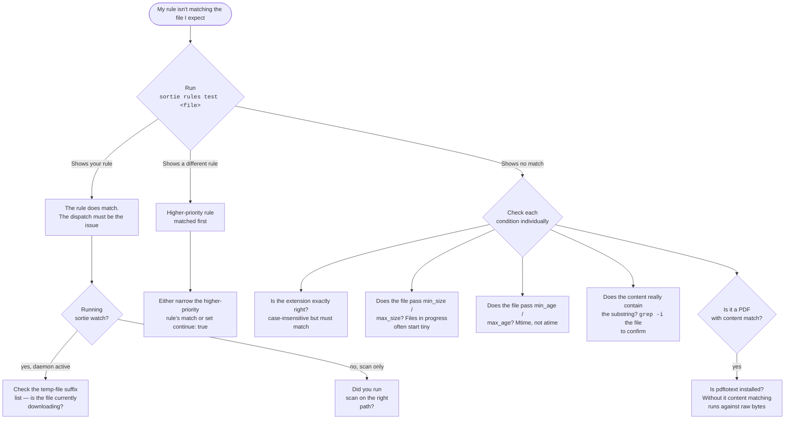
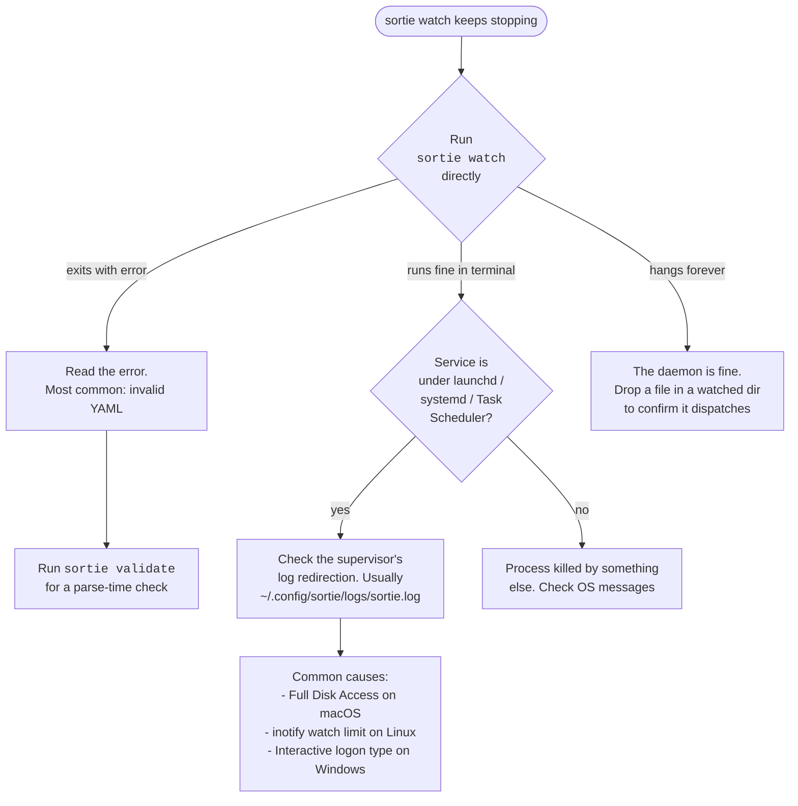
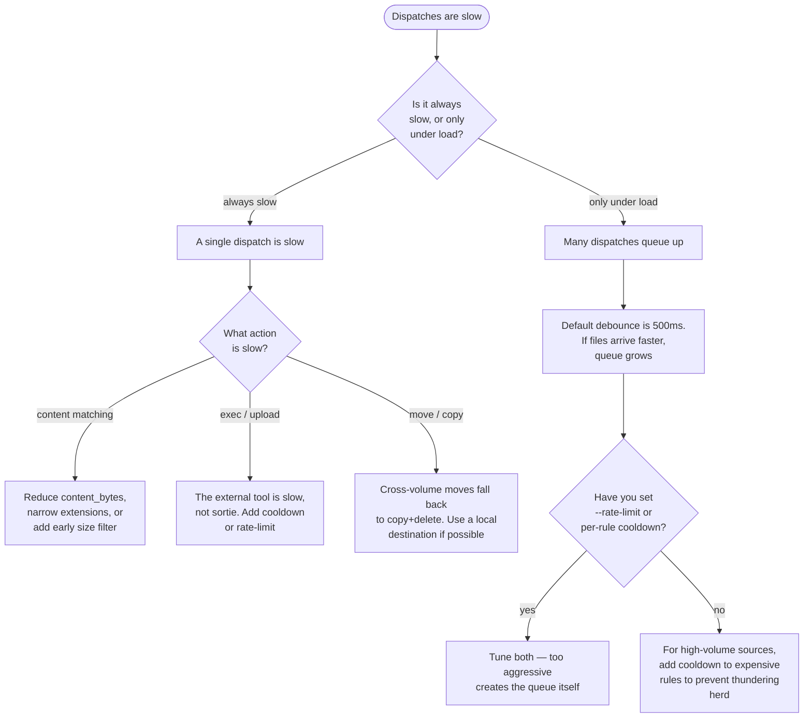

# Troubleshooting

When sortie isn't doing what you expect, this page is the first place to look.

The fastest path to a fix usually goes through three artifacts: the **log file** (what the daemon thinks happened), `sortie history` (what was dispatched), and a fresh `sortie scan --dry-run` (what *would* happen with the current rules). Most reports here boil down to combining those three.

- [Reading the log](#reading-the-log) — what every log line type means and how to filter
- [Decision trees](#decision-trees) — three guided diagnostics for the biggest categories
  - [A rule isn't matching](#a-rule-isnt-matching)
  - [The daemon won't start or won't stay up](#the-daemon-wont-start-or-wont-stay-up)
  - [Performance: dispatches are slow or backed up](#performance-dispatches-are-slow-or-backed-up)
- [Symptom → fix entries](#symptom--fix-entries) — flat list of common specific issues
- [Platform-specific gotchas](#platform-specific-gotchas)
- [Filing a useful bug report](#filing-a-useful-bug-report)

---

## Reading the log

`sortie watch` writes structured logs (text by default; JSON with `--log-format json`). The default log location is `~/.config/sortie/logs/sortie.log` when running under launchd / systemd / Task Scheduler with the recommended setup from [Running as a Service](06-running-as-a-service.md).

Tail it:

```sh
# macOS / Linux
tail -f ~/.config/sortie/logs/sortie.log

# Windows (PowerShell)
Get-Content "$env:USERPROFILE\.config\sortie\logs\sortie.log" -Wait -Tail 50
```

### Log line vocabulary

Once you know the message vocabulary, scanning the log becomes much faster. The lines you'll see most often:

| Level | Message | What it means |
|-------|---------|--------------|
| `INFO` | `dispatched` | A rule fired and its action ran. Has `rule=`, `action=`, `src=`, `dest=` fields. The single most common line. |
| `INFO` | `config reloaded` | Hot-reload picked up an edit successfully. `rules=N` shows how many global rules are now active. |
| `INFO` | `binary changed, restarting` | The daemon detected its own binary was replaced and is exiting gracefully. The supervisor (launchd/systemd/Task Scheduler) will relaunch within seconds. |
| `DEBUG` | `no match` | A file was checked against all rules and none matched. Visible only with `-v` / `--verbose`. |
| `DEBUG` | `ignored` | A file was skipped before rule matching — typically because it has an in-progress download suffix (`.crdownload`, `.part`, etc.) or is a dotfile in some configurations. |
| `DEBUG` | `cooldown` | A rule matched but is held off by its `cooldown` window. Has `rule=` and `cooldown=` fields. |
| `WARN`  | `could not write PID file` | Non-fatal — the daemon will run anyway, but `sortie status` may not be able to find it. |
| `WARN`  | `cannot watch config dir` | The reloader couldn't watch the config file's directory. Hot-reload won't work; the rest of the daemon does. |
| `ERROR` | `dispatch failed` | An action ran and failed. Has `err=` with the underlying cause (e.g. a tool's stderr). The matching history record has the same error in its `error` field. |
| `ERROR` | `loading rules` | A `.sortie.yaml` per-directory file failed to parse. Rest of the rules continue to apply. |
| `ERROR` | `config reload failed` | An edit to `config.yaml` produced invalid YAML. The daemon **keeps using the previously-loaded valid config** — it doesn't go dark. Run `sortie validate` to see the parse error. |
| `ERROR` | `watcher error` | fsnotify reported an error (e.g. inotify queue overflow on Linux). Often transient; persistent errors usually mean the OS-level limit needs raising. |

### Filtering tips

For a noisy daemon, narrow the firehose with `grep`:

```sh
# only files that actually moved
tail -f ~/.config/sortie/logs/sortie.log | grep dispatched

# only errors
tail -f ~/.config/sortie/logs/sortie.log | grep -E 'level=ERROR|level=WARN'

# everything for a specific rule
tail -f ~/.config/sortie/logs/sortie.log | grep 'rule=invoice-intake'
```

For programmatic processing, switch to JSON:

```sh
sortie watch --log-format json | jq 'select(.level == "ERROR")'
```

### Correlating logs with history

Every successful action writes one line to the log AND one record to `~/.config/sortie/history.json`. They're related but not identical:

- The **log** is operational — what the daemon was doing, errors it hit, decisions about cooldowns and reloads.
- The **history** is a record of file-state changes — what was moved/copied/deleted, when, and the chain ID for grouped operations.

When debugging "did sortie do X?", check history first (it's the source of truth for file state). When debugging "why isn't sortie doing X?", check the log (the file-state didn't change because something earlier in the pipeline shortcut).

---

## Decision trees

For the three categories that span multiple specific symptoms, walk these trees first. Each ends at a specific [symptom-fix entry](#symptom--fix-entries) below or at a self-contained answer.

### A rule isn't matching



If `sortie rules test <file>` shows the right rule but the daemon isn't dispatching, you've narrowed the problem from "the rule is wrong" to "the dispatch isn't firing." That's a much smaller search space.

If `rules test` shows no match, work down the conditions one at a time. The most common surprises:

- `extensions: [.PDF]` with a capital extension — sortie does case-insensitive comparison, but `.PDF` in your file vs `.pdf` in your YAML still works. The trap is more about typos like `extension` (singular).
- `min_size: 5MB` excluding the file you wanted to test (the test file is smaller than 5 MB).
- `content: "Invoice"` failing on a PDF because `pdftotext` isn't installed (raw PDF bytes never contain plain words).

### The daemon won't start or won't stay up



The single most useful trick for "daemon stops" issues: **stop the supervisor and run `sortie watch` directly in a terminal**. The terminal session shows errors instantly that the supervisor's log redirection sometimes swallows or buffers.

```sh
# macOS
launchctl unload ~/Library/LaunchAgents/com.msjurset.sortie.plist
sortie watch       # see errors live, Ctrl-C when done debugging
launchctl load ~/Library/LaunchAgents/com.msjurset.sortie.plist
```

```sh
# Linux
systemctl --user stop sortie
sortie watch
systemctl --user start sortie
```

```powershell
# Windows
Stop-ScheduledTask -TaskName "sortie"
sortie watch
Start-ScheduledTask -TaskName "sortie"
```

### Performance: dispatches are slow or backed up



Performance tuning is mostly about understanding **what's slow**:

- **Content matching on PDFs** is the most common slow operation — `pdftotext` shells out and reads up to 10 pages per file. For a directory full of large PDFs, this is the bottleneck. Narrow with cheap conditions first (`min_size`, `extensions`) so content matching only runs on candidates.
- **`exec` and `upload` block the dispatcher** while they run. Long-running rsync or S3 upload? Add a `cooldown:` of a few seconds so subsequent dispatches don't pile up.
- **Cross-volume `move`** falls back to copy+delete, which is much slower than a same-volume rename. Watch for this when your watched directory is on one disk and your destinations are on another.

---

## Symptom → fix entries

Direct lookup for specific issues. Skim the headings; click into anything that matches.

### A rule doesn't match a file I expected it to

**Likely causes:**

1. **Another rule with higher priority matched first.** Without `continue: true`, only the first match fires.
2. **A match condition silently excludes the file.** Conditions AND together — a `min_size: 5MB` next to `extensions: [.pdf]` rejects all PDFs smaller than 5 MB.
3. **The file is still being written.** The watcher skips files ending in `.crdownload`, `.part`, `.partial`, `.download`, and `.tmp`, which means a long download won't trigger any rule until the browser renames it to the final name.
4. **Per-directory `.sortie.yaml` rules merge with globals via priority.** If a global rule has a higher priority than your per-directory rule, the global wins.

**Diagnose:**

```sh
sortie rules test ~/Downloads/your-file.pdf
```

That walks every rule in priority order and reports which would fire (or why none did). It also shows the effective priority used in the sort.

To see all configured rules in evaluation order:

```sh
sortie rules
```

Per-directory `.sortie.yaml` rules appear inline with global rules, sorted by their effective priority.

### An action failed silently

**Likely causes:**

1. The action ran but its outcome looks like a no-op (e.g. `deduplicate` with `skip` finding an existing identical file at `dest`).
2. An external tool is missing — `notify-send` on Linux, `pdftotext` for PDF content matching, ffmpeg for video conversion, etc.
3. A template variable resolved to empty (e.g. an optional `content_regex` capture didn't fire), producing a malformed dest path.

**Diagnose:**

```sh
sortie history -n 10
```

Each record has a `rule`, `action`, `src`, `dest`, and `error` field. Errors that didn't kill the dispatcher show up here. For a deeper look — including records that completed successfully without producing visible side effects:

```sh
jq . ~/.config/sortie/history.json | less
```

Look for records where `dest` starts with `skip:` (deduplicate) or where `error` is non-empty.

For Windows-specific notify silence, see the dedicated entry below.

### `sortie watch` stopped unexpectedly

**Likely causes:**

- The daemon detected its own binary changed and exited gracefully (this is by design — see the [Daemon keeps restarting on deploy](#the-daemon-keeps-restarting-when-i-deploy) entry).
- An OS-level limit was hit (inotify watches on Linux, file descriptor limit anywhere).
- The initial config load failed at startup. Hot-reload survives invalid YAML; the **first** load doesn't.
- Permissions: macOS Full Disk Access, Linux read access on a watched directory, Windows interactive logon type.

**Diagnose:**

| Platform | Command |
|----------|---------|
| macOS (launchd) | `tail ~/.config/sortie/logs/sortie.log`, then `log show --predicate 'process == "sortie"' --last 1h` |
| Linux (systemd) | `journalctl --user -u sortie -n 200` |
| Windows (Task Scheduler) | Task Scheduler history pane, plus the file-redirected log if you set up a launcher script |

If the supervisor's log is empty or stale, run `sortie watch` from a terminal directly. The terminal session shows errors that the supervisor sometimes hides.

### Write events aren't triggering my rule

**Cause:** by default, `sortie watch` only fires on **Create** and **Rename** events. Writes to an already-existing file are ignored.

**Fix:** add `watch_existing: true` to the relevant directory entry:

```yaml
directories:
  - path: /var/log/myapp
    watch_existing: true
```

Match conditions still apply, so a growing log only dispatches once it crosses `min_size`. Pair with `cooldown:` on the rule to prevent rapid re-firing while the file is still being written.

### Windows: notifications don't show up

**Cause:** the `notify` action on Windows uses the `BurntToast` PowerShell module, which isn't installed by default. Without it, sortie falls back to writing `[sortie notify] <title>: <message>` to stderr and returning success.

**Fix:**

```powershell
# Elevated PowerShell
Install-Module -Name BurntToast
```

Then retry a notification. If toasts still don't appear after installing BurntToast, check:

- Focus Assist / Do Not Disturb is off.
- Notifications for PowerShell are allowed (Windows Settings → System → Notifications).
- You're running PowerShell 5.1 or later (`$PSVersionTable.PSVersion`).
- The Task Scheduler logon type is **Interactive** (the PowerShell `Register-ScheduledTask` snippet in [Running as a Service](06-running-as-a-service.md#install-via-powershell-recommended) sets this; the GUI defaults to "Run only when user is logged on" which is also interactive).

To confirm which backend sortie is using right now, run a rule that notifies and then search the daemon's stderr or log for `[sortie notify]` — if it's there, BurntToast isn't being picked up and you're on the fallback.

### PDF content matching returns no hits

**Cause:** sortie shells out to `pdftotext` (from poppler) for PDFs. Without it installed, `content` and `content_regex` match against raw PDF bytes, which almost never finds human-readable words.

**Fix:**

```sh
# macOS
brew install poppler

# Debian / Ubuntu
sudo apt install poppler-utils

# Windows (scoop or chocolatey)
scoop install poppler
choco install xpdf-utils
```

Also worth knowing:

- Only the **first 10 pages** are extracted (the invocation is `pdftotext -layout -l 10`). For invoices, receipts, contracts, and most reports this is plenty; for 200-page scanned archives, content past page 10 is invisible.
- Detection uses magic bytes, so a text file with a `.pdf` extension is correctly treated as text, not as a broken PDF.
- For image-only PDFs (scanned), `pdftotext` returns nothing. Use the `ocr` action with tesseract for those.

### `exec` fails on Windows with an odd error

**Cause:** `exec` runs commands through `sh -c` on Unix and `cmd /c` on Windows. Unix idioms (backticks, `$(...)`, single quotes around `{{.Path}}`, `|` pipes with Unix tools) need to be adapted for `cmd.exe`.

**Fix:**

- Use **double** quotes around path variables on Windows: `"{{.Path}}"` not `'{{.Path}}'`.
- Escape `%` as `%%` inside `cmd.exe` batch strings.
- For anything nontrivial, wrap the command in a `.bat` or `.ps1` script and invoke that from the rule. Cleaner than fighting `cmd` quoting.
- Consider using a cross-platform tool (Python, Node) invoked with an absolute path, so the same rule works everywhere.

Example that works on both Unix and Windows:

```yaml
- name: stamp-metadata
  match:
    extensions: [.jpg, .png]
  action:
    type: exec
    command: 'python3 /usr/local/bin/stamp.py "{{.Path}}"'
```

### Template expansion errors

**Symptoms:**

- `template: dest:1:5: executing "dest" at <.Foo>: can't evaluate field Foo in type rule.TemplateData`
- Empty captures producing dest paths like `~/invoices//file.pdf` (note the double slash from a missing component)

**Causes:**

- A typo in the variable name. The available set is fixed — see [Reference › Template variables](04-reference.md#template-variables). There is no `{{.Dir}}` or `{{.Size}}`.
- An optional named capture didn't match, leaving `{{.Match.company}}` empty.
- A regex copied from Perl/PCRE that uses lookbehind, lookahead, or backreferences — none of which Go's RE2 engine supports. The regex compile fails and the rule never matches.

**Fix:** wrap optional captures in Go's template `or` function:

```yaml
dest: '~/invoices/{{or .Match.company "Unknown"}}/{{or .Match.date "undated"}}-{{.Name}}{{.Ext}}'
```

Test the expansion live with `sortie scan --dry-run` on a file you know should match — the dry-run output shows the resolved dest path, so empty captures are visible immediately.

### A rule seems rate-limited and won't fire

**Cause:** either a global `--rate-limit` is preventing dispatches faster than the configured interval, or the rule has its own `cooldown:` that hasn't elapsed since the last fire. Both forms of state are **in-memory only** — there's no subcommand to inspect them, and restarting the daemon clears all counters.

**Fix:**

1. Confirm whether it's the global flag or a per-rule cooldown. Grep your config for `cooldown:` and check the supervisor's startup args.
2. If you need the rule to fire now, restart the daemon — watch-mode rate-limit state doesn't persist.
3. For long-running workloads, prefer **short** cooldowns (`100ms` to `1s`) — they prevent thundering herds without making the daemon feel laggy.

If you're seeing `cooldown` lines in the daemon log with `-v`, you've confirmed cooldown is active for that rule.

### Config hot-reload isn't picking up my changes

**Cause:** the daemon watches both `~/.config/sortie/config.yaml` and any `.sortie.yaml` inside watched directories, with a 500 ms debounce. But if your edit leaves the YAML in an invalid state, the reload fails **silently from the daemon's perspective** — the daemon logs the error and keeps running with the previously-loaded valid rules, so service stays up.

**Fix:**

```sh
sortie validate
```

Run that after every config edit. It catches invalid YAML, unknown action types, and chain-ordering bugs (e.g. `compress` before an action that needs the source). If `validate` passes but the daemon still doesn't pick up a change, tail the log:

```sh
tail -f ~/.config/sortie/logs/sortie.log
```

Save the config file. Within ~500 ms you should see either `config reloaded rules=N` (success) or `config reload failed err=...` (parse error caught silently).

### The daemon keeps restarting when I deploy

**Cause:** intentional. `sortie watch` polls its own binary's mtime every 5 seconds and exits gracefully when the file changes. Combined with `KeepAlive` (launchd) or `Restart=on-failure` (systemd) or restart settings (Task Scheduler), this means deploying a new binary auto-restarts the daemon without manual `unload`/`stop` steps.

**Fix:** nothing — this is a feature. If you specifically want to suppress it for a coordinated deploy, run `sortie watch` from a terminal (with `nohup`/`screen`/`tmux`) rather than under a service manager — the binary-swap detection still fires, but with no supervisor nothing relaunches it.

### Duplicate dispatches for the same file

**Symptoms:** a single file produces two history records with the same `src` and `action`, sometimes seconds apart.

**Likely causes:**

1. **Multiple rules matching with `continue: true`.** This is the intended behavior — see the worked example in [Concepts › Rules](02-concepts.md#worked-example-walking-three-rules). Different `rule` field values in the history records confirm this case.
2. **`watch_existing: true` plus an editor's save-over-save pattern.** Many editors save by writing to a temp file then renaming over the original, which produces two events: one rename to the final name (Create) and zero or more Writes after. With `watch_existing` enabled, both fire dispatches.
3. **The file is on a network mount and fsnotify is reporting events from both the source and a syncing process.** Less common but real.

**Fix:**

- For (1), if the duplicate is unwanted, remove `continue: true` or narrow the second rule's match.
- For (2), increase the debounce window with `--debounce 2s` to coalesce save-rename-write sequences.
- For (3), run sortie on the **destination side** of the network mount, not the watching side, if possible.

### Files in a network or external mount aren't dispatched

**Cause:** fsnotify behavior on network filesystems is OS- and protocol-specific. SMB mounts on Windows, NFS on Linux, and SMB/AFP on macOS all have spotty support for native filesystem notifications.

**Fix:**

- For one-shot needs, use `sortie scan` periodically (cron / launchd `StartInterval` / systemd timer) instead of `watch`.
- For continuous monitoring, run sortie on the host that owns the storage rather than the host that mounts it.
- If neither works, set up a poll-based fallback with a tiny `exec` rule: a script that periodically lists the directory and writes a marker file, which sortie can react to via `watch_existing: true` on the marker.

### Watch is consuming too much CPU

**Cause:** typically not sortie itself but an action that fires very frequently. The dispatcher itself is lightweight; expensive actions (content matching on big files, OCR, video transcoding) accumulate.

**Fix:**

1. Identify the busy rule. `sortie history -n 200` shows recent dispatches; counts by rule via `jq -r .rule ~/.config/sortie/history.json | sort | uniq -c | sort -rn`.
2. Add a `cooldown:` to the noisy rule.
3. Narrow its match conditions (cheap filters first — `extensions`, `min_size`, `glob` — before content matching).
4. If the noise is thumb-spamming events on temp files, check whether your editor or build system is producing many Create events. Add the offending suffix to a per-directory `.sortie.yaml` ignore pattern, or use a tighter `glob:` to filter.

### Inotify watch limit exceeded (Linux)

**Symptom:** `watcher error err="too many open files"` or `inotify_add_watch: no space left on device` in the log.

**Cause:** Linux has a per-user inotify watch limit, default `8192` on most distributions. A recursive watch on a deep tree exceeds it.

**Fix:**

```sh
echo fs.inotify.max_user_watches=524288 | sudo tee /etc/sysctl.d/40-sortie.conf
sudo sysctl -p /etc/sysctl.d/40-sortie.conf
```

`524288` is the value Visual Studio Code recommends — generous enough for any realistic sortie use case.

### macOS: rule doesn't fire on files in `~/Documents`, `~/Desktop`, or `~/Downloads`

**Cause:** modern macOS protects these directories with TCC. The sortie binary needs Full Disk Access to read events from them under launchd.

**Fix:** System Settings → Privacy & Security → Full Disk Access → click `+` and add the sortie binary explicitly. After granting, unload and reload the launchd agent so the new permissions take effect:

```sh
launchctl unload ~/Library/LaunchAgents/com.msjurset.sortie.plist
launchctl load ~/Library/LaunchAgents/com.msjurset.sortie.plist
```

Run `sortie watch` from a regular terminal first to confirm the rule fires there before debugging the launchd setup.

---

## Platform-specific gotchas

A short reference for things that aren't symptoms but show up often enough to be worth surfacing.

### macOS

- `~/Documents`, `~/Desktop`, `~/Downloads`, and several other directories require Full Disk Access for unattended daemons. See the entry above.
- `open -a` for specific apps requires the app to be present and signed correctly. macOS Gatekeeper may silently refuse to open quarantined files even via `open`.
- launchd's `KeepAlive` interacts with rate-limit state: the daemon restarting clears in-memory cooldowns. If a deploy resets your cooldowns, that's why.

### Linux

- inotify watch limit (covered above).
- `notify-send` requires `libnotify-bin`. Without it, the `notify` action errors clearly rather than silently.
- For server installations without a graphical session, `notify` actions will likely fail. Use `notify` with a webhook (`message: https://...`) for ops alerts instead.

### Windows

- Path separators in `dest:` templates can use either `/` or `\`. Sortie normalizes via `filepath.Clean`. `~` is expanded based on `os.UserHomeDir()` which returns the user profile path.
- Task Scheduler doesn't redirect stdout/stderr by default — see the launcher script in [Running as a Service](06-running-as-a-service.md#check-status-and-logs) if you need a logfile.
- BurntToast for notifications, install separately. Without it, the `notify` action falls back to stderr.

---

## Desktop notification reference

How a `notify` action should appear on each platform, side by side:

<!-- TODO: add screenshots — assets/notify-macos.png, assets/notify-linux.png, assets/notify-windows.png -->

- **macOS** — banner with the title at top, body below. Appears in Notification Center history.
- **Linux** — `notify-send` bubble in the top-right (GNOME) or bottom-right (KDE). Styled by your libnotify/desktop-environment theme.
- **Windows** — BurntToast toast in the bottom-right, persisted in Action Center. If you see `[sortie notify] Title: body` in the stderr stream instead of a toast, BurntToast isn't installed (see [Windows: notifications don't show up](#windows-notifications-dont-show-up)).

---

## Filing a useful bug report

If you've worked through the relevant decision tree and symptom entry without finding a fix, it's a real bug. Before opening an issue at https://github.com/msjurset/sortie/issues, gather:

1. **Version.** `sortie --version`.
2. **Config snippet.** The minimum `config.yaml` (or `.sortie.yaml`) that reproduces the issue. Replace any private paths or recipient keys.
3. **Test file metadata.** `ls -la <file>` and `file <file>`. For PDFs, also `pdftotext -v` to confirm the version.
4. **Dry-run trace.** `sortie scan --dry-run <file> 2>&1` if scan-related; otherwise the relevant log lines from `sortie watch`.
5. **History snippet.** Last 5–10 records: `sortie history -n 10`.
6. **What you expected vs. what actually happened.** One sentence each.

A reproducer plus the dry-run trace usually closes the loop in one round.
