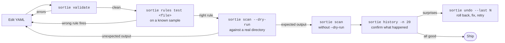

# Thinking in sortie

The other pages teach you what sortie *can* do. This page is about how to actually use it well: design patterns that recur in good rule sets, an iterative workflow for developing new rules with confidence, recipes for migrating off other file-organization tools, and a list of anti-patterns to skip past.

Read this once you've worked through [Getting Started](01-getting-started.md), [Concepts](02-concepts.md), and at least skimmed the [Cookbook](03-cookbook.md). Without that foundation, the patterns here won't have the right hooks to attach to.

- [Design patterns](#design-patterns) — six recurring shapes for well-organized rule sets
- [The iterative workflow](#the-iterative-workflow) — how to develop a new rule with confidence
- [Migration recipes](#migration-recipes) — moving from Hazel, Maid, shell scripts, or `find`+cron
- [Anti-patterns](#anti-patterns) — common mistakes the validator will catch (and a few it won't)
- [When NOT to use sortie](#when-not-to-use-sortie) — situations where another tool is the right call

---

## Design patterns

Six patterns that show up again and again in production-quality rule sets. None of these are concepts you have to learn from scratch — they're applications of the priority, `continue`, and chaining mechanics you already know — but recognizing them makes a config much faster to write.

### 1. Specific-to-generic layering

The single most common shape. Layer your rules from most-specific at the top to least-specific at the bottom. The first match wins, so specific rules have a chance to fire before generic catch-alls swallow everything.

```yaml
# Most specific: known vendor invoices
- name: invoices-acme
  priority: 100
  match:
    extensions: [.pdf]
    content_regex: '(?P<date>\d{4}-\d{2}-\d{2}).*Acme'
  action:
    type: move
    dest: ~/Documents/Invoices/Acme/{{or .Match.date "undated"}}-{{.Name}}{{.Ext}}

# Less specific: any invoice (caught by content)
- name: invoices-other
  priority: 50
  match:
    extensions: [.pdf]
    content: invoice
  action:
    type: move
    dest: ~/Documents/Invoices/_misc/{{.Name}}{{.Ext}}

# Catch-all: any PDF
- name: pdfs-other
  match:
    extensions: [.pdf]
  action:
    type: move
    dest: ~/Documents/PDFs/{{.Year}}/{{.Name}}{{.Ext}}
```

A new Acme invoice files into `~/Documents/Invoices/Acme/`. A new invoice from a vendor you haven't templated yet files into `~/Documents/Invoices/_misc/`. Anything else that's a PDF files into the generic year-partitioned PDFs folder.

**Why this works:** every PDF reaches its best home and nothing slips through. The misc bucket is a feature — it tells you about vendors you haven't templated yet, so you can promote them to a specific rule when they become regular.

### 2. Cross-cutting concerns via `continue: true`

Some behaviors should fire on **every** dispatched file, regardless of which filing rule applies — audit logging, dedup tracking, notifications. Put them at high priority with `continue: true`:

```yaml
- name: audit-everything
  priority: 1000
  continue: true
  match:
    glob: "*"
  action:
    type: exec
    command: 'echo "{{.Date}} {{.Time}} {{.Path}}" >> ~/sortie-audit.log'

- name: notify-on-pdfs
  priority: 500
  continue: true
  match:
    extensions: [.pdf]
  action:
    type: notify
    title: PDF arrived
    message: "{{.Name}}{{.Ext}}"

# All your filing rules below, at default priority 0…
```

The audit log entry fires for every file. The notification fires for PDFs specifically. After both run, evaluation continues into the actual filing logic. Three things happen, in priority order, all from one event.

**Why this works:** orthogonal concerns shouldn't be entangled in your filing rules. Adding audit logging shouldn't require touching every existing rule.

### 3. The intake → process → archive pipeline

For workflows that take messy input through several transformations to a final form, model it as a pipeline of single-purpose rules rather than one giant chain. Each rule is small, debuggable, and has a clear before/after state.

```yaml
# Stage 1: intake — rename to a stable form
- name: intake-screenshots
  priority: 100
  match:
    glob: "Screenshot*"
  action:
    type: rename
    dest: ~/Pictures/_inbox/{{.Date}}_{{.Time}}{{.Ext}}

# Stage 2: process — generate a thumbnail and a web copy
- name: process-screenshots
  priority: 50
  match:
    glob: "*"
    regex: '^\d{4}-\d{2}-\d{2}_\d{2}-\d{2}-\d{2}\.(png|jpg)$'
  actions:
    - type: resize
      width: 400
      dest: ~/Pictures/_thumbs/{{.Name}}{{.Ext}}
    - type: resize
      width: 1920
      dest: ~/Pictures/_web/{{.Name}}{{.Ext}}

# Stage 3: archive — move original to dated archive
- name: archive-screenshots
  match:
    glob: "*"
    regex: '^\d{4}-\d{2}-\d{2}_\d{2}-\d{2}-\d{2}\.(png|jpg)$'
  action:
    type: move
    dest: ~/Pictures/Archive/{{.Year}}/{{.Month}}/{{.Name}}{{.Ext}}
```

Each stage runs on the previous stage's output (the renamed file matches the date-prefix regex, so process and archive only see post-intake files). The pipeline is observable — `~/Pictures/_inbox/`, `_thumbs/`, `_web/`, and `Archive/` each contain a snapshot of what came through that stage.

**Why this works:** debugging "where did my file go?" becomes a question of which directory it last appeared in. Pipelines compose; one giant chain is opaque.

### 4. The graceful-degradation match

When a match condition is expensive or unreliable (PDF content extraction with `pdftotext`, OCR, MIME-type sniffing on large files), structure your rules so a fast cheap match catches the easy cases first, leaving the expensive matcher for fallback.

```yaml
# Cheap: name-based dispatch first
- name: file-by-name
  priority: 50
  match:
    extensions: [.pdf]
    glob: "Invoice-*"
  action:
    type: move
    dest: ~/Documents/Invoices/{{.Name}}{{.Ext}}

# Expensive: content-based dispatch as fallback
- name: file-by-content
  match:
    extensions: [.pdf]
    content_regex: '(?P<vendor>Acme|WidgetCo).*?Invoice'
  action:
    type: move
    dest: ~/Documents/Invoices/{{.Match.vendor}}/{{.Name}}{{.Ext}}
```

The first rule matches any PDF whose filename already starts with `Invoice-`, no content extraction needed. The second only runs on PDFs that didn't match the first — and pays the `pdftotext` cost only for those.

**Why this works:** at scale (a corpus of thousands of files), avoiding `pdftotext` invocations for already-named files is a substantial saving. For sortie watching `~/Downloads`, the cost is invisible per-file but adds up across a long-running daemon.

### 5. Fan-out: one event, several destinations

When the same file should go to multiple places, prefer a chain of `copy` actions over multiple rules with `continue: true`. The chain has clearer semantics (one history `chain_id`, atomic undo) and is easier to read.

```yaml
- name: fan-out-reports
  match:
    extensions: [.pdf]
    glob: "report-*"
  actions:
    - type: copy
      dest: ~/Backups/Reports/{{.Date}}_{{.Name}}{{.Ext}}
    - type: copy
      dest: ~/Dropbox/Shared/Reports/{{.Name}}{{.Ext}}
    - type: upload
      remote: "s3://reports-archive/{{.Year}}/{{.Name}}{{.Ext}}"
    - type: notify
      title: Report distributed
      message: "{{.Name}}"
```

One report becomes four artifacts: a local backup, a Dropbox-synced copy, an S3 archive, and a desktop notification. If you `sortie undo <chain_id>`, the copies are deleted and the notification stays (because notify is non-reversible) — but the chain is one logical operation in history.

**Compare** to using three separate `copy` rules with `continue: true`:

- Three history records with no shared `chain_id`. Undo treats them as independent.
- Easier to accidentally interleave with other rules' priority levels.
- Harder to reason about ordering — you don't know which copy lands first.

Use multiple rules + `continue: true` when the actions are **independent** (different content match conditions, different routing logic). Use a chain when the actions are **logically one operation** spread across destinations.

### 6. The audit trail with structured logging

Combine `--log-format json` with an `exec` audit-rule for a structured record of every file event:

```yaml
# In config.yaml
log_dir: ~/.config/sortie/logs

rules:
  - name: audit
    priority: 9999
    continue: true
    match:
      glob: "*"
    action:
      type: exec
      command: 'jq -c -n --arg ts "$(date -Iseconds)" --arg path "{{.Path}}" --arg name "{{.Name}}{{.Ext}}" ''{ts: $ts, event: "audit", path: $path, file: $name}'' >> ~/.config/sortie/logs/audit.jsonl'
```

Then run the daemon with `--log-format json` and pipe its stderr to wherever you want long-term storage:

```sh
sortie watch --log-format json 2>>~/.config/sortie/logs/sortie.jsonl
```

You now have two streams: `sortie.jsonl` (operational events from the daemon) and `audit.jsonl` (one record per file the audit rule touched). Both are jq-friendly, both are append-only, both are trivial to ship to a log aggregator.

**Why this works:** at some point you'll be asked "did sortie touch this file last Tuesday?" The structured audit answers that question in one `jq` query. The default text log answers it eventually with `grep`.

---

## The iterative workflow

The single highest-leverage habit. Every config change should go through this loop:



Each step has a clear shortcut and a clear failure mode:

| Step | What it catches | If it fails, what to do |
|------|-----------------|-------------------------|
| `sortie validate` | Invalid YAML, unknown action types, chain-ordering bugs (e.g. compress-before-source-reader) | Read the error, fix the YAML |
| `sortie rules test <file>` | Wrong-rule-fires bugs at the matching layer | Tighten the higher-priority rule's match, or set `continue: true` if you want both to fire |
| `sortie scan --dry-run` | Wrong dest paths from template expansion, files you didn't expect to match, files you did expect that don't | Edit and re-run dry-run; nothing has touched disk |
| `sortie scan` (real) | Per-file action errors (tool missing, permission denied) | Read the `error` field in `sortie history` |
| `sortie history` | Confirm reality matches your model | If something's off, `sortie undo --last N` and try again |

### Develop with a corpus

When designing rules for a new file type, build a small corpus of representative samples in a sandbox directory:

```sh
mkdir -p ~/sortie-sandbox
cp ~/Downloads/{Acme-Invoice,Globex-Receipt,random-file}.pdf ~/sortie-sandbox/
```

Then iterate against the sandbox:

```sh
sortie scan --dry-run ~/sortie-sandbox
```

The dry-run output shows every file → rule → resolved-dest mapping in one read. Edit the YAML, re-run, repeat. When you're confident the corpus is dispatched correctly, point the rule at the real directory.

This is the right workflow for content-aware rules especially — `content_regex` patterns benefit from being tested against several representative documents in fast iteration.

### Building chains step by step

For multi-action chains, develop one action at a time. Add the chain's first action and confirm it works. Add the second and confirm. Continue until the chain is complete.

```yaml
# Step 1: just move
actions:
  - type: move
    dest: ~/Documents/Invoices/{{.Name}}{{.Ext}}

# Step 2: add notify
actions:
  - type: move
    dest: ~/Documents/Invoices/{{.Name}}{{.Ext}}
  - type: notify
    title: "Invoice filed"
    message: "{{.Name}}"

# Step 3: add backup copy before move
actions:
  - type: copy
    dest: ~/Backups/Invoices/{{.Date}}_{{.Name}}{{.Ext}}
  - type: move
    dest: ~/Documents/Invoices/{{.Name}}{{.Ext}}
  - type: notify
    title: "Invoice filed"
    message: "{{.Name}}"
```

At each step, dry-run on a known-good sample, run for real, inspect history, undo if surprising. Add the next step only when the current one is solid. Building a 5-action chain in one shot is a recipe for `sortie validate` warnings about chain ordering and surprises in production.

---

## Migration recipes

If you're moving to sortie from another tool, these starting points cover the common patterns. They aren't 1:1 ports — they're idiomatic sortie equivalents.

### From Hazel (macOS)

Hazel rules map naturally onto sortie rules. The vocabulary is similar enough that the translation is mostly mechanical.

| Hazel concept | sortie equivalent |
|---------------|-------------------|
| Folder watch | `directories:` entry in `config.yaml` |
| Rule conditions (Kind, Name, Date Modified) | `match:` block with `extensions`, `glob`/`regex`, `min_age`/`max_age` |
| All / Any | sortie always uses AND — write multiple rules for OR |
| "Move file to…" | `action: { type: move, dest: ... }` |
| "Sort to subfolder" with date pattern | template variables in `dest:` (`{{.Year}}/{{.Month}}/`) |
| "Run shell script" | `action: { type: exec, command: ... }` |
| "Display notification" | `action: { type: notify, title: ..., message: ... }` |
| Color labels / Tags | `action: { type: tag, tags: [...] }` |
| "Copy file to…" | `action: { type: copy, dest: ... }` |
| "Match contents" | `match: { content: ... }` or `content_regex: ...` |
| Custom date matching | `content_regex` with named `date` capture for ISO normalization |

A starting Hazel-equivalent config:

```yaml
directories:
  - path: ~/Downloads

rules:
  # "If extension is jpg/png/heic, move to Pictures/Inbox/{Year}/{Month}"
  - name: photos
    match:
      extensions: [.jpg, .jpeg, .png, .heic]
    action:
      type: move
      dest: ~/Pictures/Inbox/{{.Year}}/{{.Month}}/{{.Name}}{{.Ext}}

  # "If extension is pdf and contents contain 'invoice', tag as Finance and move"
  - name: invoices
    match:
      extensions: [.pdf]
      content: invoice
    action:
      type: move
      dest: ~/Documents/Invoices/{{.Name}}{{.Ext}}

  # "If older than 30 days, move to Archive"
  - name: archive-old-files
    match:
      min_age: 30d
    action:
      type: move
      dest: ~/Archive/{{.Year}}/{{.Name}}{{.Ext}}
```

**Things sortie does that Hazel doesn't:** action chaining (`actions: [...]`), priority + continue (Hazel evaluates rules in folder order only), template variables across action fields beyond just dest, undo across action types, in-memory cooldown per-rule, content-regex named captures with auto date normalization.

**Things Hazel does that sortie doesn't:** sub-rules ("If a folder, run these rules on its contents") — sortie's per-directory `.sortie.yaml` covers some of this. Color label removal, sortie's `tag` only adds. Spotlight comments — no equivalent in sortie. Bouncing files to the trash with sortie's `delete` works but uses sortie's own trash, not the macOS Finder trash.

### From Maid

Maid is closer to sortie in spirit (config-as-code) but focuses on Ruby DSLs. The translation pattern: every Maid rule becomes a sortie rule with explicit YAML.

```ruby
# Maid (Ruby)
rule "Sort downloaded archives" do
  where extension(["zip", "tar.gz"])
  move_to "~/Downloads/Archives"
end
```

becomes

```yaml
- name: sort-archives
  match:
    extensions: [.zip, .tar.gz]
  action:
    type: move
    dest: ~/Downloads/Archives/{{.Name}}{{.Ext}}
```

Maid's strength is the full Ruby runtime for conditions; sortie trades that flexibility for simplicity. For complex conditional logic, fall back to `exec` calling a small script.

### From shell scripts (`find` + `cp`/`mv`)

A typical cron-driven setup:

```sh
# Every hour, move .pdf files older than 1 day from Downloads to Documents
find ~/Downloads -name "*.pdf" -mtime +1 -exec mv {} ~/Documents/PDFs/ \;
```

becomes

```yaml
- name: archive-old-downloads
  match:
    extensions: [.pdf]
    min_age: 1d
  action:
    type: move
    dest: ~/Documents/PDFs/{{.Name}}{{.Ext}}
```

Run it the same way you ran the cron — periodic `sortie scan ~/Downloads` — or upgrade to `sortie watch` for real-time reaction.

**Wins:**

- Undo with `sortie undo` (cron+find offers nothing).
- History records what was moved and when.
- Cross-platform (the same YAML works on Linux, macOS, Windows).
- Match conditions compose naturally with AND logic.

**When to keep the shell script:** if your script does something genuinely outside sortie's vocabulary — running a tool with state across files, building a manifest, transforming a directory tree topologically. Wrap it in `exec` if you need it triggered by file events; keep it in cron if you need it on a schedule.

### From custom Python/Go file-watcher scripts

If you've written a small daemon that wraps `inotify` / fsnotify yourself, sortie replaces the watching infrastructure plus the dispatch logic. The translation:

| Your code | sortie equivalent |
|-----------|-------------------|
| `inotifywait -m` loop | `sortie watch` with `directories:` |
| `if filename.endswith(".pdf")` | `match: { extensions: [.pdf] }` |
| `shutil.move(src, dst)` | `action: { type: move, dest: ... }` |
| `subprocess.run([...])` | `action: { type: exec, command: ... }` |
| Logging to stdout | sortie's structured log + history |
| ad-hoc dedup logic | `action: { type: deduplicate, ... }` |

The substantial code you wrote becomes 30 lines of YAML. If your script does something sortie can't (cross-file state, complex transformations), keep that piece and have sortie call it via `exec`.

---

## Anti-patterns

Mistakes that show up frequently. Some are caught by `sortie validate`; others fail subtly at runtime.

### Putting `compress` before something that needs the source

```yaml
# WRONG
actions:
  - type: compress
    dest: ~/Archives/{{.Name}}{{.Ext}}.gz
  - type: upload
    remote: "s3://bucket/{{.Name}}{{.Ext}}"   # source is gone!
```

`compress` removes the original after gzipping. The subsequent `upload` runs against a missing source path and fails. **`sortie validate` catches this.**

Fix by ordering source-preserving actions first, source-consuming actions last. Or use `copy` instead of `compress` to keep the original around:

```yaml
actions:
  - type: copy
    dest: ~/Archives/{{.Name}}{{.Ext}}
  - type: upload
    remote: "s3://bucket/{{.Name}}{{.Ext}}"
  - type: delete
```

### Putting `deduplicate` inside a chain

```yaml
# WRONG
actions:
  - type: deduplicate
    dest: ~/Archive/{{.Name}}{{.Ext}}
    on_duplicate: skip
  - type: tag
    tags: [Imported]
  - type: notify
    title: Imported
```

`deduplicate` has three possible outcomes: `skip` (source stays), `move` (source consumed), `delete` (source consumed). On `move` or `delete`, the subsequent `tag` and `notify` actions either fail (source is gone) or operate on the wrong file. **`sortie validate` warns about this.**

Fix by making `deduplicate` a separate rule with its own priority. Run dedup first; if it skips, the original file remains and the triage rule fires on it.

### Catch-all rules with `continue: false` swallowing everything

```yaml
- name: catch-all
  priority: 1000        # too high
  match:
    glob: "*"
  action:
    type: move
    dest: ~/Triage/{{.Name}}{{.Ext}}
```

A `glob: "*"` at priority 1000 with no `continue` matches every file before any specific rule has a chance. **Symptom:** all your files end up in `~/Triage/`, none in their proper destinations.

Fix by giving catch-alls **low** (or negative) priority and letting them be the last resort, not the first responder.

### Side effects before structural ops

```yaml
# WRONG-ish
actions:
  - type: notify
    title: Filing in progress
    message: "{{.Name}}"
  - type: move
    dest: ~/Documents/{{.Name}}{{.Ext}}
```

Not a `sortie validate` warning, but: if the `move` fails, the user has been notified that filing is in progress when it actually wasn't. Reverse the order — file first, notify on success — so the notification is a confirmation rather than a misleading promise.

### Using `exec` when there's a built-in action

```yaml
# WRONG
action:
  type: exec
  command: 'cp "{{.Path}}" ~/Backups/{{.Name}}{{.Ext}}'
```

Use the built-in `copy` action. Reasons:

- The built-in is reversible; `exec` isn't.
- The built-in is cross-platform; `cp` doesn't exist as a recognizable command on Windows `cmd.exe`.
- The built-in writes a structured history record; `exec` writes a generic "exec ran" entry.
- If you need to deviate (different cp flags, atomic copies via `cp --reflink`), then `exec` is appropriate — but only as the escape hatch.

### Reading the entire file with `content_regex` when a glob will do

```yaml
# WRONG-ish
match:
  content_regex: 'invoice'      # actually a substring; should be `content:`
  extensions: [.pdf]
```

If your match is a literal substring, use `content: "invoice"` (case-insensitive substring) rather than `content_regex: 'invoice'` (compiled regex). The former is faster and more obviously what's happening to a reader.

If your `content_regex` could be replaced by a filename pattern (`glob:` or `regex:`), prefer that — it's vastly cheaper because no file content is read.

### Forgetting `cooldown:` on rules that fire from `watch_existing`

```yaml
- name: rotate-large-logs
  match:
    extensions: [.log]
    min_size: 100MB
  # NO cooldown!
  actions:
    - type: copy
      dest: ~/Archives/{{.Name}}-{{.Date}}{{.Ext}}
    - type: upload
      remote: "s3://logs/{{.Name}}-{{.Date}}.log"
    - type: delete
```

With `watch_existing: true` on the directory, every Write event on the log file re-fires this chain — potentially many times per second on a busy log. Add `cooldown: 1m` (or longer) so the chain fires once per cooldown window, not per write.

### Hardcoding paths that should be templates

```yaml
# WRONG
action:
  type: move
  dest: ~/Documents/PDFs/file.pdf       # always the same dest!
```

This overwrites the same file every time the rule fires. Use template variables to vary the dest:

```yaml
dest: ~/Documents/PDFs/{{.Year}}/{{.Name}}{{.Ext}}
```

The conflict resolver (`_001`, `_002`, …) saves you from clobbering same-name-different-content files, but it's a safety net, not the right design.

---

## When NOT to use sortie

Sometimes another tool is the right call. A non-exhaustive list of cases where sortie is the wrong shape:

### Bidirectional file sync

You want changes on machine A to propagate to machine B and vice versa. **Use Syncthing, Resilio, or a cloud sync service.** sortie is one-shot and one-directional — it routes files based on rules, not synchronizes state across endpoints.

### Sub-second responsiveness

The watcher debounces 500 ms by default to ride out in-progress writes. If you genuinely need single-millisecond reactions to file events (high-frequency trading, kernel telemetry, real-time security tools), sortie's debounce architecture is wrong for the job.

### Cluster-coordinated rule execution

Multiple sortie daemons watching the same directory will both fire on the same event. **Use a single daemon**, or coordinate at the storage layer (e.g. a single canonical writer, downstream consumers reading from a queue).

### File transformation requiring state across files

"Build a thumbnail strip from every photo taken on the same day," or "concatenate all JSON files in this folder into a single output." sortie processes one file per dispatch — no cross-file coordination. **Use a build tool** (Make, Just) or a small script triggered by sortie's `exec` action when a sentinel file appears.

### Pure scheduled jobs

If you want something to run "every Monday at 2 AM regardless of file events," you want **cron / launchd / systemd timer**, not sortie watch. You can use `sortie scan` from a scheduled job for the file-routing parts of the work, but the schedule itself doesn't need sortie.

### Encrypted networked filesystems

fsnotify behavior on FUSE-mounted encrypted volumes (gocryptfs, encfs, age-mount) is unpredictable. **Run sortie inside the encrypted container** if possible (so it sees the plaintext directly and uses native fsnotify on a real filesystem), not on the encrypted overlay.

---

## Where to go next

- [Cookbook](03-cookbook.md) — concrete recipes that exercise the patterns from this page.
- [Reference](04-reference.md) — exhaustive lookup tables.
- [Troubleshooting](05-troubleshooting.md) — when one of the patterns isn't behaving the way you'd expect.
- [Concepts](02-concepts.md) — the mental model these patterns are built on.
